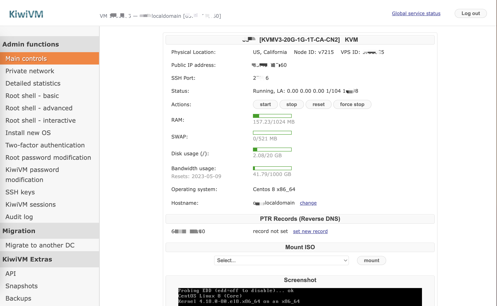
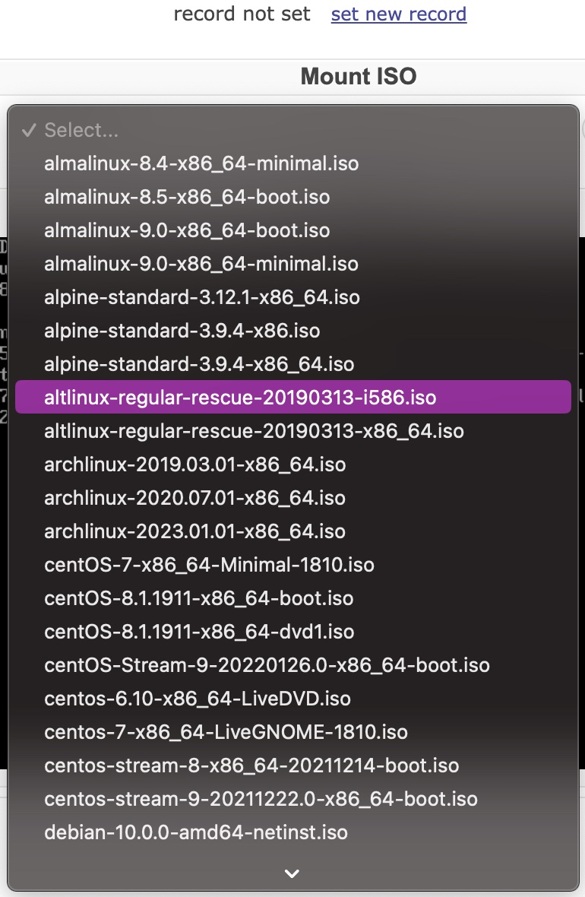

# 这里记录下如何搭建一个个人用的 vps

通过一个 vps，我们可以在上面做很多事情，比如个人网站，文件存储，代理等。

如果只是上外网需求 （Google, ChatGPT, 油管等），建议购买搬瓦工官方机场 JustMySocks，稳定低延迟出国上网服务，最主要的是不怕墙！
5.25%优惠码： `JMS9272283`, 具体可参考: [itblogcn](https://www.itblogcn.com/article/1012.html)

## 步骤

### 购买一个 vps

首选需要买一个 vps，这里以搬瓦工为例，当然，还有其他的服务商也可以。

搬瓦工中国的地址是：[https://bwh81.net/](https://bwh81.net/), 一般刚入门买最便宜的就行，对应的配置是：`20G SSD + 1G RAM + 2x CPU + 1T带宽`，价格是`49.99美元每年`.

支持支付宝付款，比较方便。

另外付款前可以在里面输入`优惠码`，享受一个折扣。优惠码可以从[这里](https://github.com/ostli/ostli-vps/tree/main/banwagong)获取。

### 启动、登录 vps

购买完成后，稍等会就能拿到 vps 对应的公网 ip 和 ssh 端口、密码等信息。方便我们通过 ssh 登录 vps：

```sh
# 假如你的端口是8888，ip是66.66.195.66，则这样登录
# 备注: 按提示输入密码，就能登录上去
➜  ssh -p8888 root@66.66.195.66
```

同时搬瓦工还提供 web 版的控制台，地址大概类似这样：`https://kiwivm.64clouds.com/1888888/main.php`。其中 `1888888` 是 vps id，每台 vps 应该都是不同的。



默认会挂载 CentOS 7(也可能会变化)，搬瓦工默认支持几十种系统和版本，如下，我们可以按需挂载其他版本的系统，但重新挂载会销毁原来系统的内容，需要注意。



### 安装代理脚本

```sh
bash <(curl -s -L https://git.io/v2ray.sh)
```

参考： <https://github.com/233boy/v2ray/wiki/V2Ray%E4%B8%80%E9%94%AE%E5%AE%89%E8%A3%85%E8%84%9A%E6%9C%AC>

### 使用客户端配置代理

#### Windows

<https://github.com/2dust/v2rayN/releases/>

#### Mac

<https://github.com/Cenmrev/V2RayX/releases>

参考：<https://github.com/xyz690/v2ray/wiki/V2Ray%E5%AE%A2%E6%88%B7%E7%AB%AF%E4%BD%BF%E7%94%A8%E6%95%99%E7%A8%8B>
